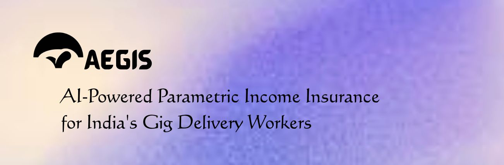
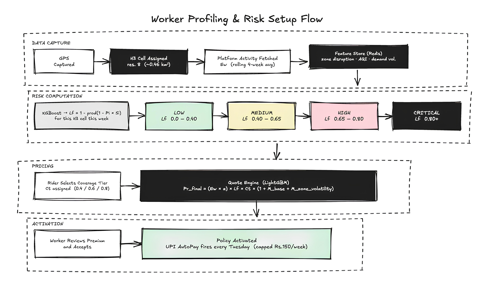
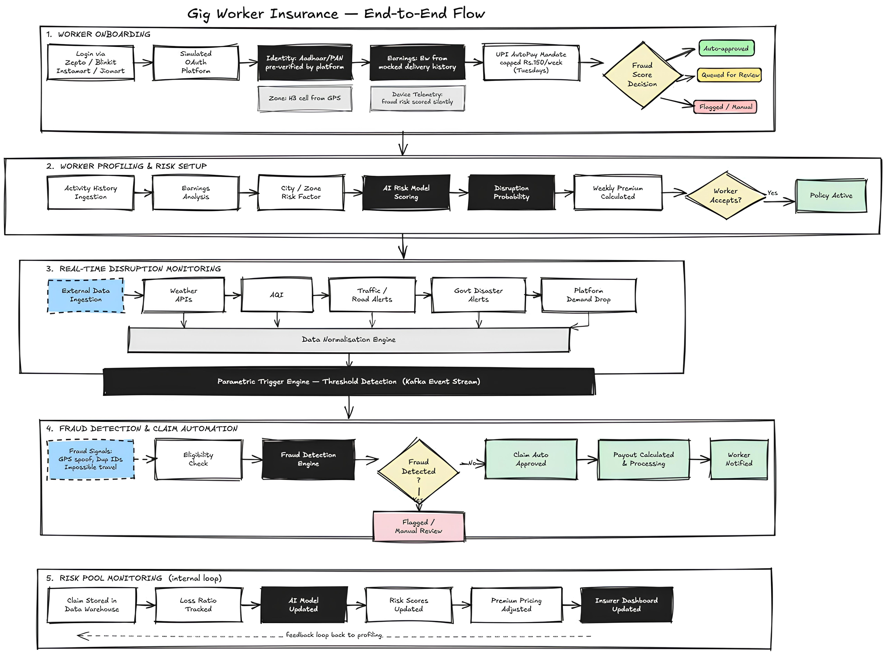
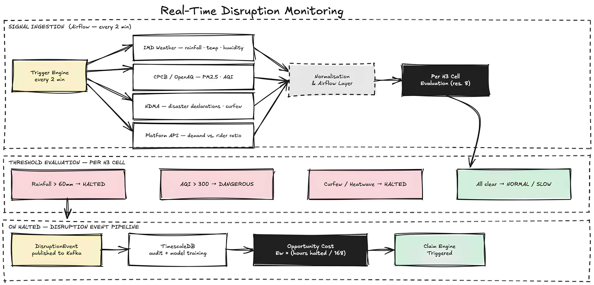
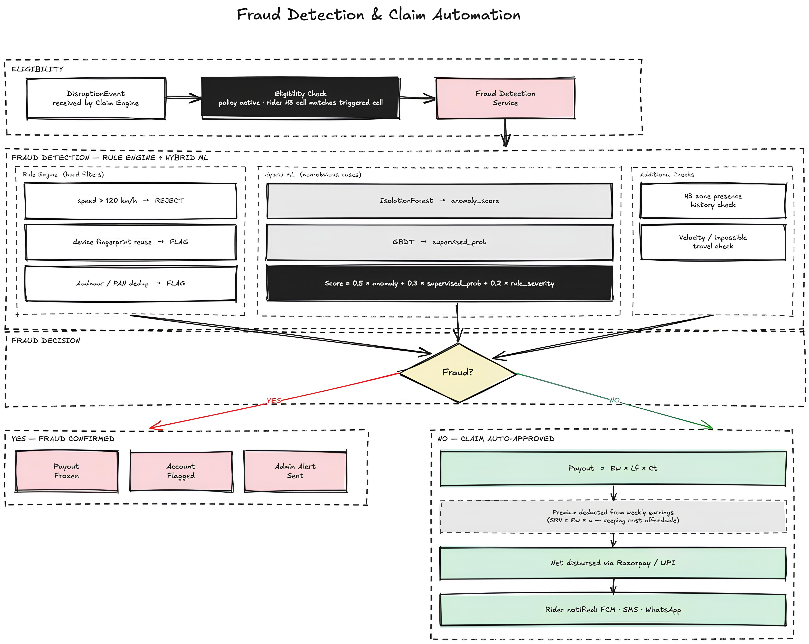
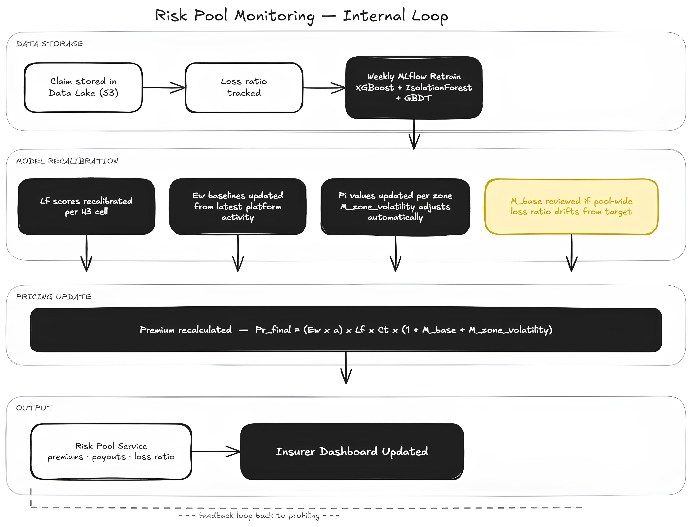
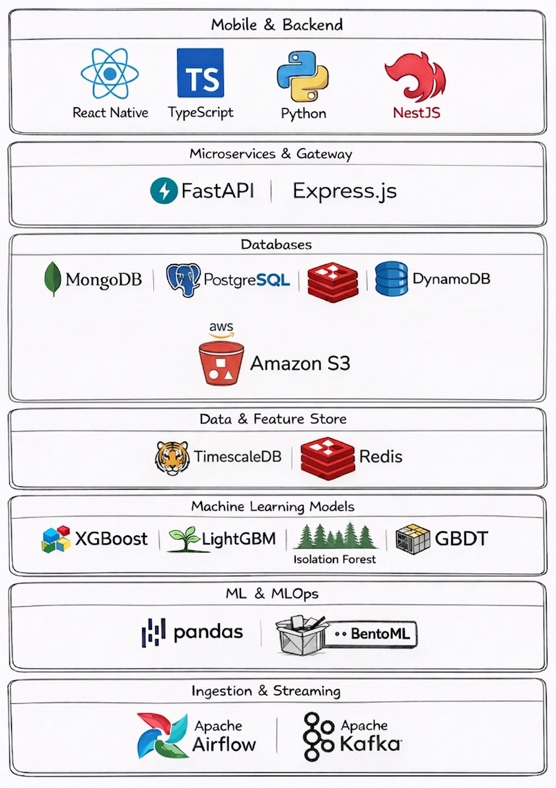
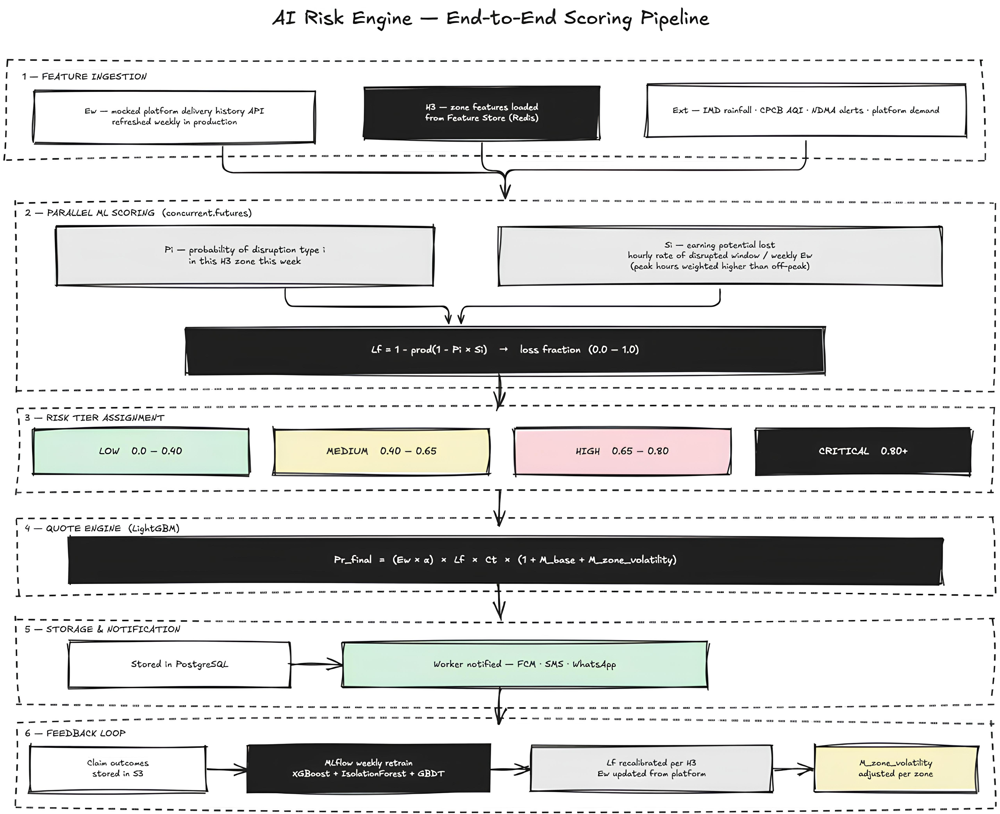
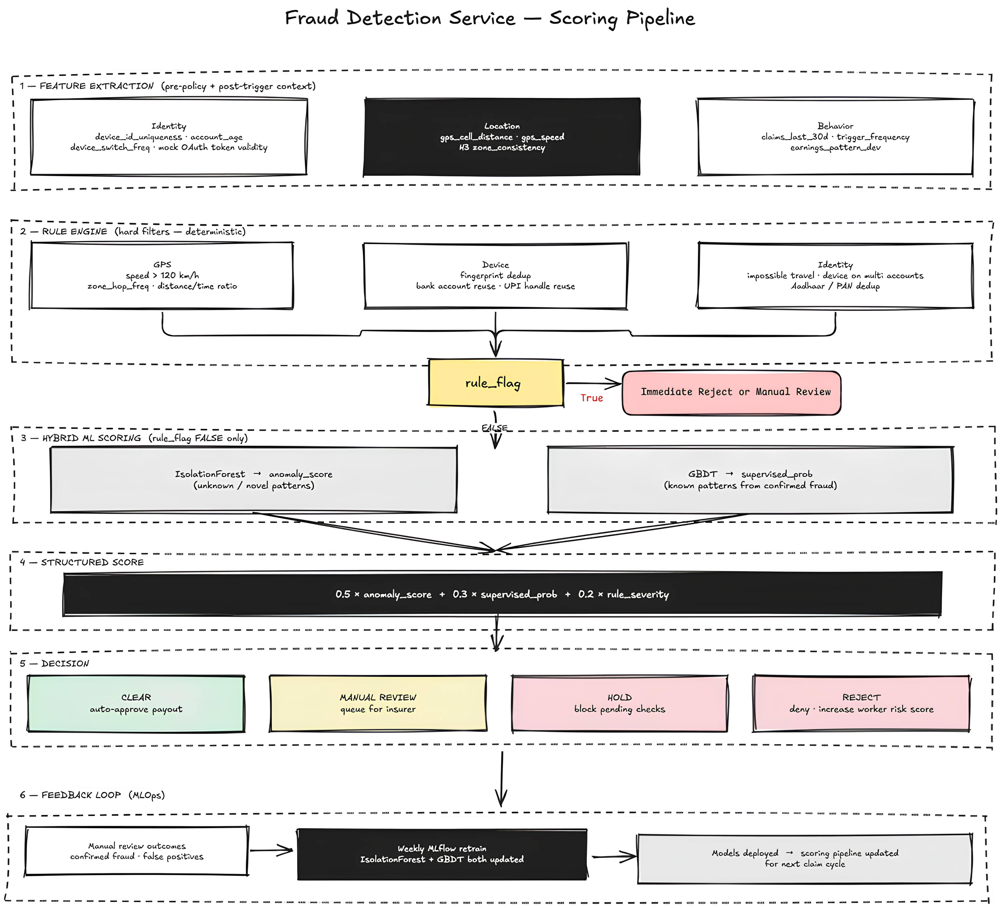

<!-- # Aegis

**AI-Powered Parametric Income Insurance for India's Gig Delivery Workers** -->



If a rider's zone goes unserviceable, money hits their account automatically. No claim forms, no waiting, no explaining yourself to anyone.


<div align="center">

<a href="https://youtu.be/demo-link"></a>
&nbsp;&nbsp;
<a href="https://drive.google.com/pitch-deck"></a>
&nbsp;&nbsp;

<a href="https://aegis-alpha-ebon.vercel.app">
  
</a>
&nbsp;&nbsp;
<a href="https://www.figma.com/board/LS4Gyn0BSu8m8GOSSmJQVv/Untitled?node-id=0-1&p=f&t=fY1uvzAt4x7J9VnT-0">
  
</a>

</div>


## Insurance Sense Status (Current Ubuntu Branch)

This is the current implementation reality for checklist items 28-36.

- [28] Objective trigger thresholds: DONE. `TriggerService` now returns explicit threshold evaluation (`zoneRequiredStates`, `lfMinApprove`, fraud hold/reject thresholds) on the approval path.
- [29] Fully automatic payout path: DONE. Flow is trigger -> GPS/H3 zone match -> fraud check -> payout transfer via RazorpayX (UPI/BANK) with explicit transfer rail metadata; synthetic reference mode remains only for test/demo when source account is absent.
- [30] Sustainability metric: DONE. Admin analytics returns `lossRatio`, `lossRatioPercent`, and `benefitCostRatio`.
- [31] Fraud is data-driven: DONE. GPS, H3 consistency, velocity, and burst signals are active in fraud scoring.
- [32] Frictionless premium collection: DONE. Recurring premium collection runs hourly with billing mandates and invoices; optional live debit webhook integration supports non-simulated recurring collection.
- [33] Dynamic pricing: DONE. Premium uses risk-linked dynamic computation (`Ew`, `Lf`, `Ct`) with service fallback.
- [34] Adverse selection lockout: DONE. New policies have a 24-hour cooling-off period; payout rejects lockout period usage.
- [35] Straight-through operations: DONE (Post-remediation). Payout retry queue and fraud review queue now auto-resolve via scheduled STP processors with threshold-based outcomes and exhaustion-to-DLQ controls.
- [36] Hyper-local basis risk control: DONE. H3 cell and policy zone consistency checks are enforced before payout.

### Recurring Billing Integration Variables

- `RECURRING_BILLING_DEBIT_WEBHOOK_URL`: Live recurring debit connector endpoint (if set, billing uses live gateway path).
- `RECURRING_BILLING_DEBIT_WEBHOOK_TOKEN`: Optional auth token sent as `x-aegis-recurring-token`.
- `RECURRING_BILLING_ALLOW_SIMULATION`: Set to `false` to disallow synthetic recurring debits.

### STP Automation Variables

- `PAYOUT_RETRY_MAX_ATTEMPTS`: Max automatic payout retry attempts before DLQ dead-lettering.
- `PAYOUT_RETRY_BATCH_SIZE`: Maximum retry jobs processed per cron cycle.
- `FRAUD_AUTO_QUEUE_APPROVE_MAX`: Max risk score for automatic approval of inconclusive fraud queue cases.
- `FRAUD_AUTO_QUEUE_REJECT_MIN`: Min risk score for automatic rejection in fraud queue.
- `FRAUD_AUTO_QUEUE_BATCH_SIZE`: Maximum fraud queue records auto-resolved per cron cycle.


## Table of Contents

<div align="center">

<a href="https://youtu.be/demo-link"></a>
&nbsp;&nbsp;
<a href="https://drive.google.com/pitch-deck"></a>
&nbsp;&nbsp;

<a href="#problem-understanding"></a>
<a href="#persona-definition"></a>
<a href="#policy-plan-tiers--event-coverage"></a>
<a href="#architecture-overview"></a>
<a href="#why-uber-h3"></a>
<a href="#end-to-end-workflow"></a>
<a href="#tech-stack"></a>

<br/>

<a href="#data-architecture"></a>
<a href="#ai-and-ml-models"></a>
<a href="#adversarial-defense--anti-spoofing"></a>
<a href="#performance--impact"></a>
<a href="#roadmap"></a>
<a href="#data-sources--libraries"></a>

</div>

---

## Problem Understanding

We didn't start from assumptions. We actually went to Zepto, Blinkit and Swiggy Instamart dark stores and talked to the supervisors running them. What they said changed how we framed the whole thing.

**What the supervisors said:** These stores run 24/7. The whole "rain = no income" framing is too simple and honestly a bit wrong.

> *"We run around the clock. The only time a rider truly loses income is when the zone becomes unserviceable — and that only happens under extreme conditions. But when it does happen, it happens to everyone at once and there is nothing any of them can do."*
> — Dark store supervisor, Blinkit

> *"Riders actually get surge bonuses when they deliver in rain. The ones who stay out earn more. The income loss hits the ones whose zone gets marked unserviceable — they can't even try."*
> — Dark store supervisor, Zepto Instamart

> *"Every platform pays differently. Zepto is weekly. Swiggy can be daily. Blinkit has its own cycle. When a rider loses a day in a daily-pay platform, the hit is immediate. For weekly-pay riders, it compounds across the week silently."*
> — Dark store supervisor, Swiggy Instamart

So here's the actual problem: rain doesn't hurt riders, it helps them (surge pay). What actually wipes their income is **zone unserviceability** — when the platform officially calls a zone non-operational and kills all dispatch. Orders stop, surge disappears, and the rider can do nothing about it no matter how willing they are.

That's exactly why parametric insurance fits here. The trigger isn't the rider's behaviour or choice — it's a hard, external threshold. Zone goes HALTED, payout fires. Simple.

The other thing that came out of field research was the payout cycle difference across platforms. A Swiggy daily-pay rider losing one day feels it that night. A Zepto weekly-pay rider losing two days might not notice until Friday when their weekly total looks short. Same income loss, completely different financial stress timeline. So `Ew` (the earnings baseline) has to be normalised per platform, not treated as a uniform number.

Traditional insurance has no way to see any of this. There's no physical damage, no injury, no visible event to file against. From an insurer's perspective the loss simply doesn't exist — even though for the rider it's immediate and total.

---

## Persona Definition

**Delivery Partner — Zepto / Blinkit / Swiggy Instamart**

| Attribute | Zepto | Blinkit | Swiggy Instamart |
|---|---|---|---|
| Payout cycle | Weekly | Weekly | Daily / Weekly (rider choice) |
| Earnings range | ₹5,000–₹6,000/week | ₹5,500–₹6,500/week | ₹4,500–₹8,000/week |
| Surge bonus in rain | Yes — active riders earn more | Yes | Yes |
| Zone unserviceability trigger | Platform-declared, extreme conditions | Platform-declared, extreme conditions | Platform-declared, extreme conditions |
| Work pattern | 24/7 dark store operations · rider shift-based | 24/7 dark store operations · rider shift-based | 24/7 dark store operations · rider shift-based |
| Operating radius | 2–4 km from dark store | 2–5 km from dark store | 3–5 km from dark store |

**The real income loss trigger — zone unserviceability**

Rain alone doesn't stop a rider's income. They actually earn more when it rains. The income hit comes only when the platform marks the zone **unserviceable** — triggered by extreme weather, flooding, civic shutdowns, or safety conditions. Once that happens:

- All order dispatch halts for the zone
- Surge bonuses are gone
- Riders on the ground cannot work no matter what
- The platform offers no compensation

That's the specific event Aegis is built around. Not "bad weather." The moment a zone tips into unserviceability.

**What kills their income — updated from field research**

| Disruption | Real-world threshold | Effect |
|---|---|---|
| Zone declared unserviceable | Extreme rainfall, flooding, safety conditions | All dispatch halts · zero income · surge bonuses gone |
| Insufficient rider coordination | Too few riders for order volume | Individual rider misses surge window · earnings drop |
| Platform payout cycle mismatch | Daily-pay rider loses a high-value day | Financial stress hits immediately, before weekly avg recovers |
| Civic bandh / govt shutdown | Zone closure declared | Platform halts operations · no orders dispatched |

> The rider is willing. The bike is ready. The zone itself is what stops them.

**Primary Research Findings** — every design decision traces back to what supervisors and riders told us.

| Pain Point | Source | Aegis Response |
|---|---|---|
| Zone unserviceability has no compensation | Dark store supervisors, all 3 platforms | Parametric payout fires at zone HALTED threshold — no claim needed |
| Surge bonus disappears exactly when conditions are worst | Riders, Blinkit + Zepto | Payout calculated on `Ew` baseline, not surge-adjusted earnings — protects base income |
| Each platform has different payout cycles | Supervisors, all 3 platforms | `Ew` normalised per platform cycle · UPI AutoPay timed to each platform's payout day |
| No advance warning before zone goes unserviceable | Riders across platforms | Live zone state (NORMAL / SLOW / DANGEROUS / HALTED) visible in app before threshold crossed |
| Insurance too complex to claim | Riders | No claim process — payout fires automatically at zone HALTED |

Riders earn more in bad weather. The actual problem is the very specific moment a zone tips into unserviceability and every incentive structure collapses at once. That's the only thing Aegis insures.

---

## Policy Plan, Tiers & Event Coverage

### Policy Plan

Just one plan — `Delivery Partner Income Shield`. 2-month enrollment, paid week by week.

**How premium collection works:** It goes through UPI AutoPay e-Mandate, capped at ₹150/week, deducted every Tuesday. That's intentional — Tuesday is when most riders have just received their platform payout, so liquidity is highest. No platform integration needed; AutoPay is completely independent of Zepto, Blinkit or Swiggy.

### Weekly Premium Calculation

Every insurance premium in the world is built on the same actuarial identity:

> **Premium = Expected Loss × Coverage Factor × Sustainability Margin**

**Expected Loss:**

$$\text{Expected Loss} = E_w \times L_f$$

- `Ew` — rolling 4-week average earnings. A ₹8,000/week rider pays more and gets more. A ₹3,000/week rider pays less and gets proportionally less.
- `Lf` — Loss Fraction: the composite disruption risk for a rider's H3 zone, computed by XGBoost:

$$L_f = 1 - \prod_{i=1}^{n}(1 - P_i \times S_i)$$

- `Pi` = probability of disruption type `i` this week, pulled from IMD, CPCB, NDMA and platform signals
- `Si` = earning potential lost, not just hours lost. A 4-hour Friday evening disruption has higher `Si` than an 8-hour Monday morning one because peak windows carry disproportionate earnings. Weighted by hourly rate divided by weekly `Ew` baseline.

`Lf` is the compounded probability that at least one disruption causes income loss this week. It's always higher than any single event probability on its own.

> **Collinearity note:** Heavy rain and waterlogging tend to happen together. Treating them as independent events would underestimate the actual risk. XGBoost groups correlated disruptions into composite triggers before computing `Lf`, so that assumption gets eliminated at the feature level.

**Coverage Factor:**

$$C_t \in \{0.4,\ 0.6,\ 0.8\}$$

**Sustainability Margin:**

$$M = M_{base} + M_{zone\_volatility}$$

- `M_base` — fixed pool margin (~8–12%), Monte Carlo calibrated, ruin probability kept below 1%
- `M_zone_volatility` — zone-level adjustment, never individual. If a zone floods repeatedly, `Pi` rises, `Lf` rises, premium rises for the whole zone. **A rider is never penalised for a flood they had nothing to do with.**

**Final Weekly Premium:**

Multiplying directly against full weekly earnings would push premiums into the hundreds — completely unworkable for someone earning ₹5,000–₹8,000/week. Instead the formula uses a **Sachet Risk Value (SRV)**, a base rate anchored to a small affordable fraction of weekly earnings:

$$\boxed{Pr_{final} = SRV \times L_f \times C_t \times (1 + M)}$$

Where:

$$SRV = E_w \times \alpha$$

`α` is the **affordable risk fraction**, set at **0.015** (1.5% of weekly earnings). This is in line with microinsurance pricing benchmarks for low-income workers globally.

**Example check:** ₹8,000/week rider · `Lf` = 0.4 · Standard tier (`Ct` = 0.6) · `M` = 0.1

`SRV = 8,000 × 0.015 = ₹120` → `120 × 0.4 × 0.6 × 1.1 = ₹31.68/week` ✅ (within ₹150 cap)

$$\boxed{Pr_{final} = E_w \times \alpha \times L_f \times C_t \times (1 + M)}$$

| Variable | Represents | Computed as |
| --- | --- | --- |
| `Ew` | Rider's weekly earnings baseline | Rolling 4-week avg from the Sovereign DynamicQCommerce identity provisioning engine (Zepto/Swiggy/Blinkit high-fidelity provider API) |
| `α` | Affordable risk fraction | 0.015 — 1.5% of weekly earnings (microinsurance benchmark) |
| `SRV` | Sachet Risk Value — affordable base rate | `Ew × α` |
| `Lf` | Loss fraction — composite zone risk | XGBoost: `1 - ∏(1 - Pi × Si)`, correlated events grouped |
| `Pi` | Disruption probability type `i` | IMD, CPCB, NDMA, platform feed |
| `Si` | Earning potential lost for disruption `i` | Hourly earn rate of disrupted window ÷ weekly `Ew` — peak weighted |
| `Ct` | Coverage tier factor | 0.4 / 0.6 / 0.8 |
| `M_base` | Pool sustainability margin | Monte Carlo — ruin probability < 1% |
| `M_zone_volatility` | Zone-level risk adjustment | Auto-rises with `Pi` — never per-rider |
| `Ct_scaled` | Auto-scaled coverage for part-timers | `15 / (SRV × Lf × (1+M))` when raw premium < ₹15 floor |

**Bounds:** Floor ₹15/week, ceiling ₹150/week (UPI AutoPay mandate cap). A clean 7-day IMD forecast brings `Lf` down and the premium drops automatically.

**Part-timer protection — dynamic `Ct` scaling:** For lower-earning or part-time riders, `SRV = Ew × α` can produce a raw premium that falls below ₹15. Just charging them the flat floor would effectively double their risk rate relative to earnings, which isn't fair. So instead:

$$\text{If } Pr_{raw} < ₹15, \quad C_t \text{ auto-scales up so } Pr_{final} = ₹15$$

$$C_{t,scaled} = \frac{15}{SRV \times L_f \times (1 + M)}$$

The part-timer still pays ₹15, but their `Ct` rises to compensate — meaning they get **proportionally higher payout coverage** for the same floor price.

**Example:** Priya earns ₹2,000/week. Raw: `SRV = 30 → Pr = ₹7.92`. Floor applies: `Ct` auto-scales to `15 / (30 × 0.4 × 1.1) = 1.136` → Priya pays ₹15 and gets **113.6% income replacement** on a disrupted day. Better than a full-time rider on Basic tier.

---



### Policy Tiers

| Tier | Covered Events | Who It's For |
| --- | --- | --- |
| **Basic** | Rain, Flood, Extreme Heat | Essential protection |
| **Standard** | Basic + AQI events | Full-time metro workers |
| **Premium** | Standard + Bandh, Strike, Curfew | High-risk zones or high-earnings weeks |

### Coverage by Tier

| Disruption | Category | Basic | Standard | Premium |
| --- | --- | :---: | :------: | :-----: |
| Heavy Rain (>60mm) | Environmental | ✅ | ✅ | ✅ |
| Flood / Zone Inundation | Environmental | ✅ | ✅ | ✅ |
| Extreme Heat / Heatwave | Environmental | ✅ | ✅ | ✅ |
| Hazardous AQI (>300) | Environmental | ❌ | ✅ | ✅ |
| Severe AQI (200–300) | Environmental | ❌ | ✅ | ✅ |
| Civic Bandh / Strike | Social | ❌ | ❌ | ✅ |
| Local Protest / Curfew | Social | ❌ | ❌ | ✅ |
| Platform-Declared Zone Halt | Social | ❌ | ❌ | ✅ |

> **Not covered:** Vehicle repair, fuel costs, device damage, platform-side cancellations, personal illness.

### Data Sources

| Source | Signal | Link |
| --- | --- | --- |
| IMD Weather API | Rain, Flood, Heat, Heatwave | [mausam.imd.gov.in](https://mausam.imd.gov.in/) |
| OpenAQ / CPCB | PM2.5, AQI, O3, NO2 | [docs.openaq.org](https://docs.openaq.org/) |
| NDMA | Disaster declarations, curfew alerts | [ndma.gov.in](https://ndma.gov.in/) |
| Google Routes / Maps API | Traffic, road closures, strike impact | [developers.google.com](https://developers.google.com/maps) |
| Nominatim | Pincode → LAT/LON | [nominatim.org](https://nominatim.org/) |
| Uber H3 | Hexagonal micro-zone indexing (~0.46 km²/cell) | [h3geo.org](https://h3geo.org/) |
| Platform API | Zone closures, demand drop signals | Sovereign DynamicQCommerce Provider |

---

## Architecture Overview

Polyglot microservices — NestJS handles identity, policy and orchestration; Python services cover ML, zone logic and pricing; Kafka as the event bus; Redis as the Feature Store.



### Component Responsibilities

| Component | Responsibility |
| --- | --- |
| API Gateway | Routing, JWT auth, rate limiting |
| Identity Service | RFC 6749 / PKCE-compliant Sovereign Platform OAuth (Zepto/Blinkit/Swiggy) — cryptographically provisions Aadhaar/PAN, `Ew`, H3 zone via the DynamicQCommerce engine. Zero manual entry. Real production: B2B partnership |
| Worker Profile Service | City, zone, platform, activity signals |
| Policy Service | Coverage activation, `Pr = (Ew×α)×Lf×Ct×(1+M)` calc, UPI AutoPay mandate, risk pool booking |
| Worker Activity & Earnings Service | `Ew` from Sovereign DynamicQCommerce delivery history — refreshed weekly. Production: real platform API |
| Data Ingestion Layer | External feed aggregation via Apache Airflow |
| Kafka Event Bus | Publishes `DisruptionEvent` (h3_cell_id + zone_state) |
| Parametric Trigger Engine | Per-H3-cell threshold evaluation every 2 minutes |
| AI Risk Engine | XGBoost `Lf`, LightGBM pricing, disruption forecasting |
| Feature Store (Redis) | ML feature serving — `Lf`, `Ew`, weather, H3 cell keyed |
| Claim Engine | H3 eligibility check, payout calculation |
| Fraud Detection Service | Rule engine + IsolationForest + GBDT hybrid |
| Payment Service | Razorpay / UPI payout |
| Notification Service | FCM, SMS, WhatsApp |
| Risk Pool Service | Premium/payout tracking, loss ratio |
| TimescaleDB | Time-series storage — weather, AQI, GPS, zone trigger history |
| Data Lake (S3) | Historical store for weekly MLflow retraining |

---

## Why Uber H3

Pincodes and ward boundaries just don't work for hyper-local insurance. They're too coarse, irregularly shaped, and have no hierarchy. A single Bengaluru pincode can cover 3–8 km². A cloudburst that floods one street while the next one 2 km away is completely fine would end up triggering payouts for thousands of riders who weren't affected at all.

H3 splits the earth into equal-area hexagons. Aegis runs at **resolution 8 (~0.46 km²)** which closely matches the actual cluster a delivery rider operates in.

| H3 Property | What it enables |
| --- | --- |
| Uniform cell size | Risk scores and rider counts are directly comparable with no normalisation needed |
| Hexagonal adjacency (6 equidistant neighbours) | Lets us model flood/AQI spread, zone state propagation and fraud ring clustering naturally |
| Hierarchical indexing | Res 8 nests inside res 6 (city-level) — same index covers both payout eligibility and risk pool aggregation |
| O(1) GPS → zone lookup | One math operation, no DB spatial join — critical when 10,000 riders are active every 2 minutes |
| Compact 64-bit cell IDs | Millions of GPS pings a day stored efficiently in PostgreSQL/TimescaleDB |

### Where H3 is used

| System | Role |
| --- | --- |
| Sovereign Onboarding | Deterministic platform GPS history → primary H3 operating zone assigned |
| Parametric trigger engine | Threshold breaches fire against a specific h3_cell_id |
| Claim eligibility | Rider GPS → H3 cell must match triggered cell or an adjacent cell |
| Zone presence history | Every delivery ping logged as `(rider_id, h3_cell_id, timestamp)` |
| Zone state machine | Each H3 cell: NORMAL / SLOW / DANGEROUS / HALTED, evaluated every 2 min |
| XGBoost risk scoring | H3 cell disruption frequency pre-computed, cached in Redis by cell ID |
| Fraud ring detection | Claimed H3 cell cross-checked against cell tower data |
| Premium pricing | Zone-level base risk anchored to H3 cell historical disruption frequency |

### Resolution choice

| Resolution | Cell area | Verdict |
| --- | --- | --- |
| 6 | ~36 km² | Too coarse — entire city districts in one zone |
| 7 | ~5.2 km² | Still too coarse |
| **8** | **~0.46 km²** | **Right fit — matches rider operating cluster** |
| 9 | ~0.1 km² | Too fine — starts splitting intersections, creates edge disputes |

For reference, resolution 8 is what Uber itself uses in production for surge pricing and driver dispatch.

---

## End-to-End Workflow

### 1. Worker Onboarding — Zero-Type (RFC 6749-Compliant Sovereign Platform OAuth)

Standard KYC flows have ~85% drop-off. Aegis eliminates all manual entry through the **Sovereign DynamicQCommerce OAuth engine** — a fully self-contained, RFC 6749 / RFC 7636-compliant authorization server that deterministically provisions operator identity and earnings from any registered Q-Commerce provider.

Onboarding takes about 4 seconds. No typing. Identity, earnings baseline and H3 zone come pre-filled directly from the DynamicQCommerce identity provisioning engine, reflecting what a real Zepto or Blinkit OAuth would return in production at B2B scale.

KYC state machine: `NOT_STARTED → IN_PROGRESS → SUBMITTED → APPROVED / REJECTED`

### 2. Real-Time Disruption Monitoring



Zone reopens at 50% capacity first, then scales to 100% after 15 minutes of confirmed stability.

### 3. Automatic Payout on HALTED Event



### 4. Risk Pool Feedback Loop



---

## Tech Stack



---

## Data Architecture

### Zone Intelligence Snapshot (every 10 min per H3 cell)

| Field | Source | Usage |
| --- | --- | --- |
| `h3_cell_id` | Uber H3 res 8 | Primary key for all zone operations |
| `rainfall_3hr_avg` | IMD | HALTED trigger (>60mm) |
| `temperature` | IMD | Heatwave detection |
| `aqi_pm25` | CPCB / OpenAQ | DANGEROUS trigger (>300) |
| `civic_alert_active` | NDMA | Curfew / disaster flag |
| `platform_demand_ratio` | Platform API | Order volume vs. active riders |
| `lf_score` | XGBoost | Loss fraction `Lf` → premium formula |
| `zone_state` | Trigger Engine | `NORMAL / SLOW / DANGEROUS / HALTED` |

### Onboarding State Machine

```
NOT_STARTED → IN_PROGRESS → SUBMITTED → APPROVED
                                      ↘ REJECTED
```

### Fraud Risk Tiers

| Score | Classification | Action |
| --- | --- | --- |
| 0–30% | LOW | Auto-approved |
| 30–70% | MEDIUM | Admin review queue |
| 70%+ | HIGH | Manual investigation |

### Zone Risk Tiers

| Lf Score | Tier | Meaning |
| --- | --- | --- |
| 0.0–0.40 | LOW | Minimal disruption expected |
| 0.40–0.65 | MEDIUM | Moderate risk this week |
| 0.65–0.80 | HIGH | Disruption likely |
| 0.80+ | CRITICAL | Near-certain — maximum premium |

---

## AI and ML Models

| Model | Algorithm | Purpose |
| --- | --- | --- |
| Risk Scoring | XGBoost | `Lf` per H3 zone — core premium variable |
| Premium Pricing | LightGBM | `Pr_final = (Ew × α) × Lf × Ct × (1 + M)` — α = 0.015 |
| Fraud (Onboarding) | Rule engine | Device integrity + GPS checks at sovereign OAuth boundary — silent, zero-friction |
| Fraud (Claims) | IsolationForest + GBDT | `0.5 × anomaly + 0.3 × supervised_prob + 0.2 × rule_severity` |
| Disruption Forecast | Time-series regression | 7-day forward `Lf` for predictive premium discounts |

All models versioned through **MLflow**, served via **BentoML**, retrained weekly from S3.

### Risk Assessment Pipeline



### Fraud Detection Pipeline



---

## Adversarial Defense & Anti-Spoofing

> _500 accounts. Coordinated GPS spoofing. A liquidity pool draining in real time._
> _Here's how Aegis fights back — and why genuine riders are never caught in it._

A fraud ring doesn't look like one bad actor. It looks like 50–500 accounts on shared infrastructure, all piling into the same H3 cell the moment HALTED triggers — GPS coordinates identical or grid-snapped, payout requests firing in a synchronised burst. Each individual account looks fine on its own. The ring only becomes visible when you look at the graph.

### Detection Signals

**Signal 1 — Real workers leave messy data. Adversarial actors leave clean data.**

Genuine riders produce noisy, human GPS traces: drift of 3–10m, accelerometer micro-vibrations, realistic battery drain, the odd signal dropout. Spoofers show perfectly static GPS, flat accelerometer readings, battery patterns inconsistent with outdoor use, and an account that showed up in this H3 cell for the first time today.

**Signal 2 — Fraud rings give themselves away through graph structure**

| Graph Signal | What It Reveals |
| --- | --- |
| Shared device fingerprint | Same hardware template copied at scale |
| Registrations within 6-hour window | Batch signup, not organic growth |
| UPI IDs → same beneficiary (2-hop) | Payout destination laundering |
| Zero H3 zone presence history | Account only exists to collect the payout |

**Signal 3 — H3 zone presence has to be earned**

Every delivery ping is logged as `(rider_id, h3_cell_id, timestamp)`. You can't claim a HALTED payout in a cell you have no verified history in. A fraud ring can't manufacture weeks of consistent zone history retroactively.

**Signal 4 — Physics doesn't lie**

Last H3 ping in Koramangala 8 minutes ago, now filing from Andheri — physically impossible. Hard block. Velocity analysis runs on every payout request.

**Signal 5 — The ML composite catches whatever rules miss**

`0.5 × anomaly + 0.3 × supervised_prob + 0.2 × rule_severity` — IsolationForest carries more weight at launch because confirmed fraud labels are sparse early on. GBDT weight increases as real confirmed cases accumulate through retraining.

### Response Protocol

| Confidence | Evidence | Action |
| --- | --- | --- |
| Confirmed clean | H3 history ✅ + Device ✅ + Physics ✅ | Auto-approve immediately |
| Suspicious individual | 1–2 signals, no ring link | Hold 2h, fast-track manual review |
| Ring-connected | Graph links to flagged cluster | Freeze, flag, admin alert |
| Confirmed fraud | Clone + velocity + ring | Blocked, suspended, Aadhaar/PAN flagged |

### Defense Coverage Matrix

| Attack Vector | Detection | Response |
| --- | --- | --- |
| Single GPS spoof | GPS drift + H3 cell tower cross-check | Flag, manual review |
| Coordinated ring (50+) | Device fingerprint graph + reg clustering | Batch hold, quarantine |
| First-time zone fraud | H3 zone presence history | Blocked until history established |
| Impossible velocity | Inter-ping velocity analysis | Hard block |
| Emulator-based spoofing | Accelerometer + battery + network coherence | Device integrity failure |
| Payout laundering | UPI/bank beneficiary graph (2-hop) | Destination quarantine |
| Volume flooding | Statistical volume anomaly per H3 cell | Batch hold, human review |
| Bot-speed filing | Timestamp Poisson test | Batch flagged |

> To beat Aegis you'd need to simultaneously spoof GPS, physics, weeks of H3 zone history, device behaviour and a social graph — all in real time. For weekly payouts, that's just not economically worth it for any fraud operation.

---

## Performance & Impact

| Metric | Value |
| --- | --- |
| ML risk inference latency | < 80ms per H3 zone |
| Zone state refresh | Every 2 minutes |
| Zone intelligence aggregation | Every 10 minutes (Airflow) |
| Redis feature store hit rate | ~94% after warm-up |
| Dashboard API response | < 350ms (p95) |
| H3 GPS → zone lookup | O(1) — no DB join |
| Risk scoring accuracy (`Lf`) | ~91% — XGBoost, 365-day synthetic dataset |
| Premium pricing MAE | < ₹3.50 — LightGBM validation set |
| Income protected per disruption day | ₹800–₹1,200 per rider (earnings-proportional) |
| Payout delay | Zero — fires at threshold breach |
| Addressable market | 10 million+ gig delivery workers in India |
| Fraud defense layers | 5 independent signals + hybrid ML composite |
| Zone granularity | ~0.46 km² per H3 cell (resolution 8) |

---

## Roadmap

### Next 2 Weeks — Build Sprint

| Week | Focus | Key Deliverables |
| --- | --- | --- |
| **Week 1** | Infrastructure | Live IMD + CPCB via Airflow · Kafka + TimescaleDB wired · XGBoost trained on real data · UPI AutoPay mandate via Razorpay |
| **Week 2** | Product | HALTED trigger on live data · End-to-end payout disbursed · Mobile zone dashboard live · 5-rider pilot in 2 Bengaluru H3 zones |

### SOAR Phase

| Pillar | Goals |
| --- | --- |
| **Scale** | 50+ H3 zones across Bengaluru, Delhi NCR, Mumbai · 500 riders onboarded D2C · Real platform B2B or AA-based `Ew` inference |
| **Operate** | Weekly MLflow retrain on real claim history · WhatsApp zone alerts · Vernacular app (Hindi, Tamil, Kannada, Telugu) |
| **Acquire** | Payout-driven referral loop · Delivery partner WhatsApp group seeding · Employer bulk onboarding |
| **Regulate** | IRDAI Sandbox registration · Licensed insurer as risk carrier · Inter-platform portability |

---

## Data Sources & Libraries

[IMD](https://mausam.imd.gov.in/) · [OpenAQ](https://openaq.org/) · [NDMA](https://ndma.gov.in/) · [Uber H3](https://h3geo.org/) · [Nominatim](https://nominatim.org/) · [XGBoost](https://xgboost.readthedocs.io/) · [LightGBM](https://lightgbm.readthedocs.io/) · [scikit-learn](https://scikit-learn.org/) · [MLflow](https://mlflow.org/) · [BentoML](https://www.bentoml.com/) · [Kafka](https://kafka.apache.org/) · [Airflow](https://airflow.apache.org/)

---

*Built for the 10 million gig workers who keep India's cities moving.*