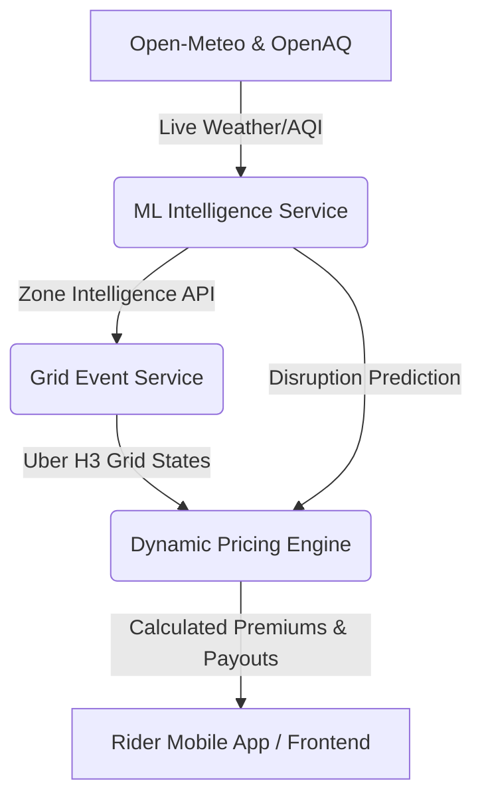

# 🛡️ RideSafe-AI Backend Architecture

Welcome to the backend architecture for **RideSafe-AI**, a hyper-local AI-driven gig worker income protection system. This ecosystem dynamically adjusts premiums and payouts based on environmental risk, platform demand, and predicted disruption events for Quick Commerce delivery riders (Zepto/Blinkit personas).

The backend is built using **FastAPI** and is split into three distinct, specialized microservices designed for high performance, modularity, and rapid geographic indexing.

---

## 🏗️ Architecture Overview

The system operates on an event-driven, pipeline-based flow where raw environmental signals are ingested, transformed into machine learning predictions, geographically bound to micro-zones, and finally evaluated for dynamic financial coverage.



---

## 📦 Microservices

### 1. 🧠 ML Intelligence Service (`ml_microservice`)
**Port: `8000`** | **Storage: `PostgreSQL`, `Redis`**

Provides core environmental intelligence and predictive machine learning. 
It ingests active civic factors and processes them through a trained `RandomForest` model (`risk_model.pkl`) to identify upcoming disruption severity. 

**Key Features:**
- **Real-time Live Fallbacks:** Actively polls `Open-Meteo` (Weather/Rain) and `OpenAQ` / `CPCB` (Air Quality Index / PM2.5).
- **Geolocation Resolution:** Converts delivery pincodes into actionable LAT/LON coordinates using `Nominatim` OpenStreetMap caching via Redis.
- **Risk Inference:** Outputs hyper-accurate probability calculations (e.g., `disruption_probability: 0.85`).

**Core Endpoints:**
- `GET /zone-intelligence/{zone_id}`: Standardized aggregate intel output.
- `POST /internal/environment-data`: Internal data-pipeline ingestion.

---

### 2. 🗺️ Grid Event Service (`grid_event_service`)
**Port: `8001`** | **Storage: `PostgreSQL`**

Responsible for converting abstract zone intelligence into rigid, geographically-actionable mapping configurations using **Uber H3 Hexagonal indexing**.

**Key Features:**
- **Grid Evaluation Engine:** Uses deterministic business logic to map intelligent signals into physical operational states:
  - `HALTED` → Rainfall > 40mm or Disruption > 80%
  - `DANGEROUS` → AQI > 300
  - `SLOW` / `NORMAL`
- **Background Aggregator:** Maintains a continuously running APScheduler (`Grid Monitor Workspace`) performing parallelized evaluation refreshes of known zones every 2 minutes.

**Core Endpoints:**
- `GET /grid-state/zone/{zone_id}`: Retrieves exact mapping state for frontend rendering.

---

### 3. 💸 Dynamic Pricing & Payout Engine (`pricing_engine`)
**Port: `8003`**

A fully real-time calculation system that guarantees continuous income for gig-workers while protecting platforms from catastrophic civic events.

**Key Features:**
- **Dynamic Micro-Zone Pricing:** Instead of static city-wide prices, creates a multi-variable `Zone Risk Score` scaling premiums accurately based on localized floods, pollution, and historical claims.
- **Deduction Payout Logic:** Simulates zero-upfront-cost models by connecting to external platform APIs. Deducts insurance premiums directly from the driver's next weekly payout securely.
- **Opportunity Cost Surge Evaluator:** Estimates "Lost Surge Income." If a H3-Grid shuts down for extreme rain, this calculates exactly what the Rider lost and automates an appropriate payout payload.
- **Predictive Discounts:** Evaluates 7-day Open-Meteo forecasts; if a rider covers an incoming safe-weather week, they automatically receive a 10% premium discount.

**Core Endpoints:**
- `POST /calculate-premium`: Dynamic base risk pricing.
- `POST /deduct-premium`: Seamless end-of-week wallet integrations.
- `POST /calculate-opportunity-payout`: Dynamic surge-loss accounting.
- `POST /calculate-predictive-discount`: Safety incentives.

---

## 🚀 Running the Ecosystem Locally

Each service operates independently within the local workspace using Python virtual environments. 

### Prerequisites
1. Ensure your shared Python `venv` is activated.
   ```bash
   .\venv\Scripts\activate
   ```
2. Make sure you have downloaded or installed local Redis (if caching is desired).

### Start Development Servers

All servers are designed to run side-by-side using `uvicorn` hot-reloading configurations.

**Terminal 1:** ML Microservice
```bash
cd backend/ml_microservice
pip install -r requirements.txt
uvicorn app.main:app --host 127.0.0.1 --port 8000 --reload
```

**Terminal 2:** Grid Microservice
```bash
cd backend/grid_event_service
pip install -r requirements.txt
uvicorn app.main:app --host 127.0.0.1 --port 8001 --reload
```

**Terminal 3:** Pricing Engine
```bash
cd backend/pricing_engine
pip install -r requirements.txt
uvicorn app.main:app --host 127.0.0.1 --port 8003 --reload
```

### 🧪 API Documentation

Once running, interactive **Swagger UI** playgrounds are automatically generated for each module:
- ML Intelligence: `http://127.0.0.1:8000/docs`
- Grid Event Mapping: `http://127.0.0.1:8001/docs`
- Pricing Engine: `http://127.0.0.1:8003/docs`
